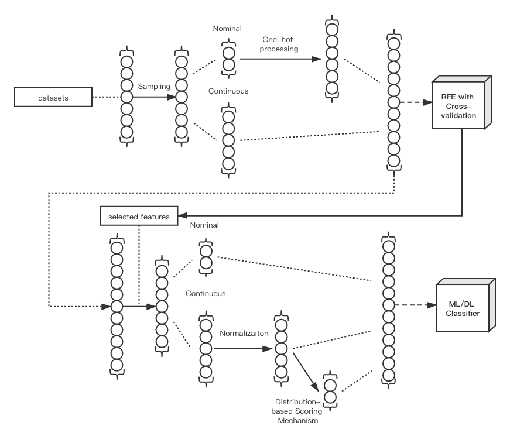

# IDSwithDSM
code for paper: A Reliable and Universal Classifier with Utilizing a Novel Distribution-based Scoring Mechanism for Building Network Intrusion Detection System

### Our proposed framework displays as follows:

### You can see code of our framework in these three paths: 
#### KDDCup99: /KDD99_Related/KDD_framework.ipynb
#### CICIDS2017: /Test7/CICIDS2017_framework.ipynb
#### UNSW-NB15: UNSW-NB15_related/UNSW-NB15_framework.ipynb

### You might need to import datasets by yourself if you want to test the code:
#### KDDCup99:    /KDD99_Related/kddcup.data_10_percent
#### CICIDS2017:  /MachineLearningCVE/
#### UNSW-NB15:   /UNSW-NB15_related/UNSW-NB15 - CSV Files/

